# Card Component Visual Diagrams

Visual representations of how PropertyReelsView, PropertyReelCard, ProjectReelCard, and BaseReelCard interact.

---

## 📊 Component Hierarchy

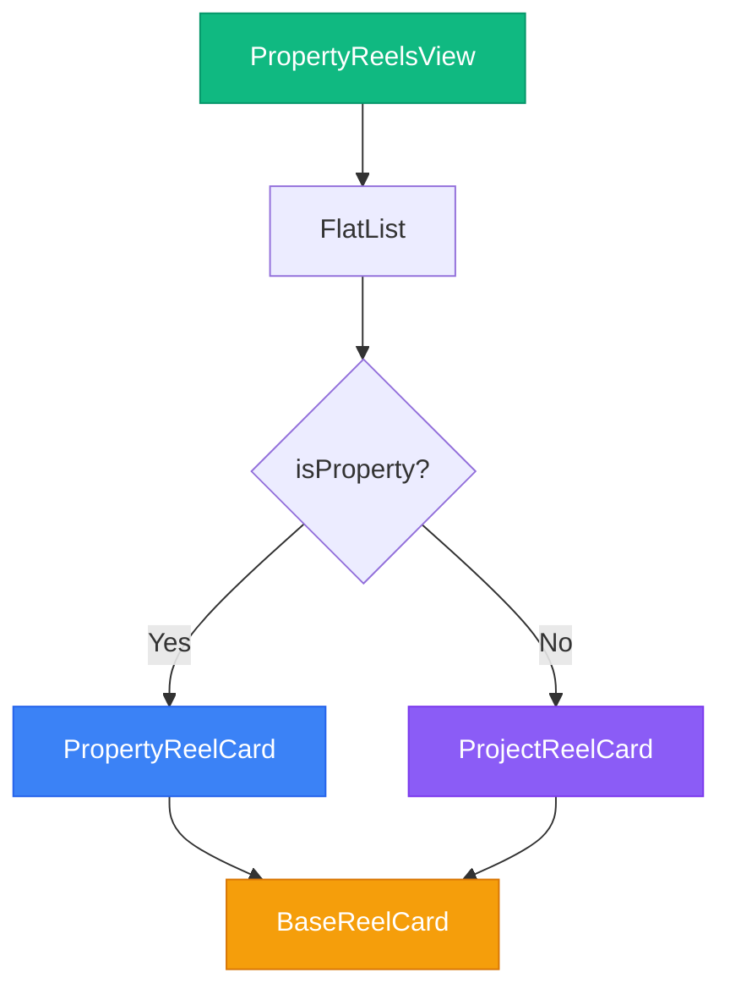

---

## 🔄 Props Flow Diagram

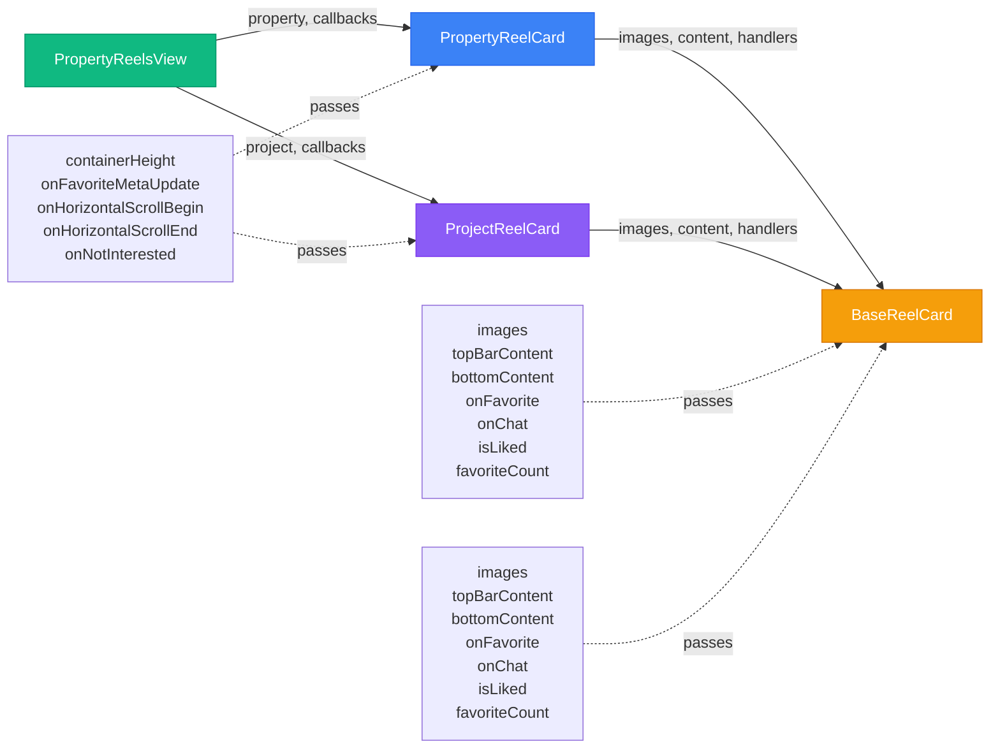

---

## 📥 Data Flow: Favorite Action

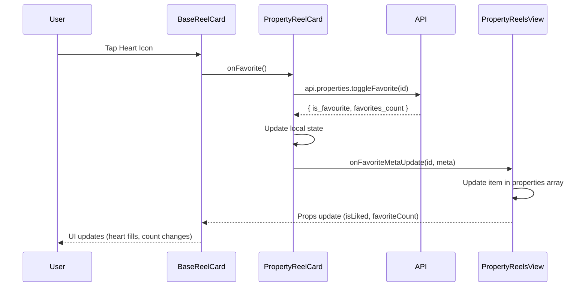

---

## 🔒 Scroll Lock Flow

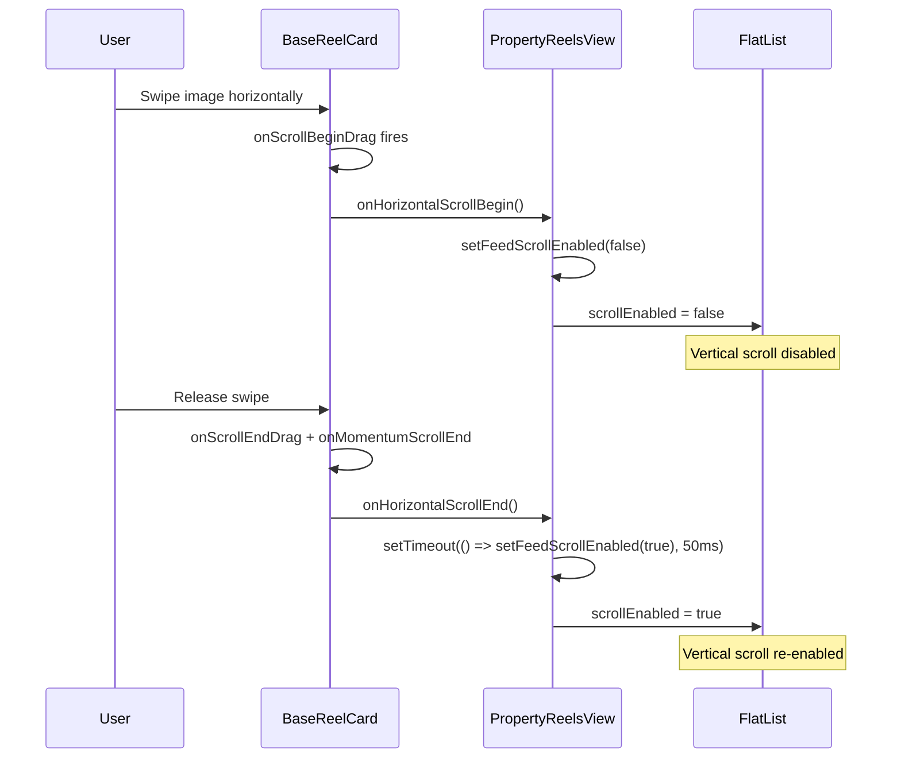

---

## 🖼️ Image Carousel Flow

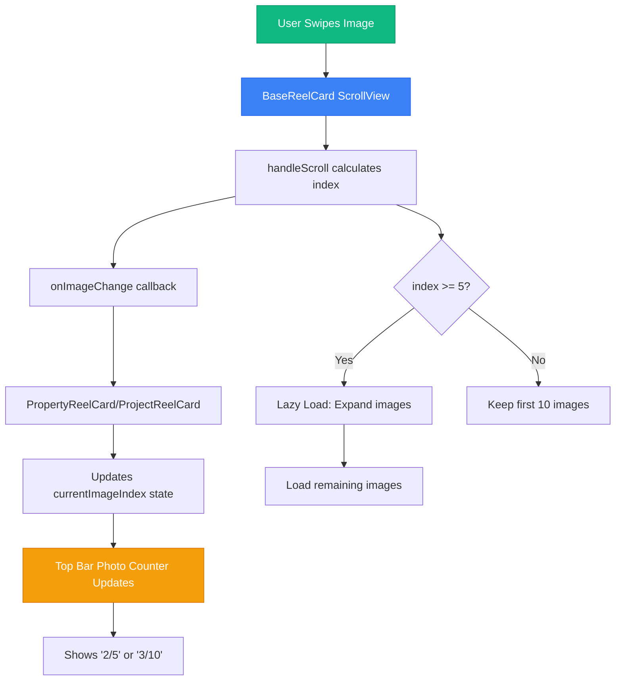

---

## 🎯 Component Responsibilities

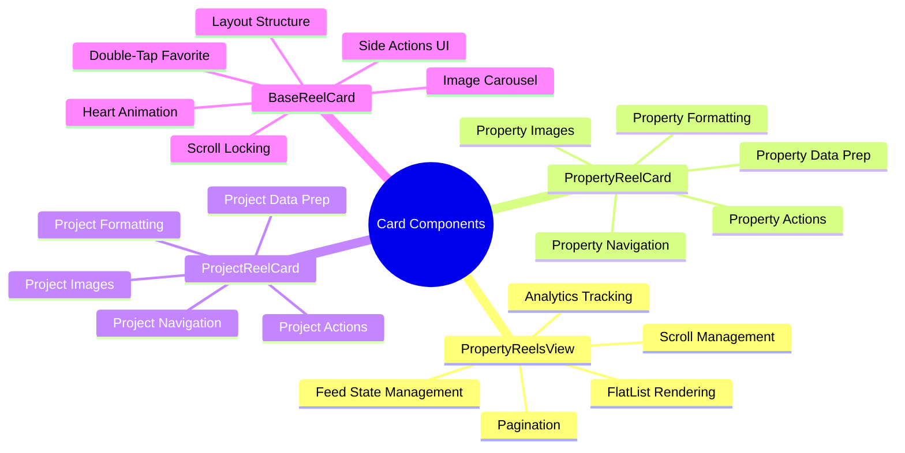

---

## 🔀 Rendering Decision Flow

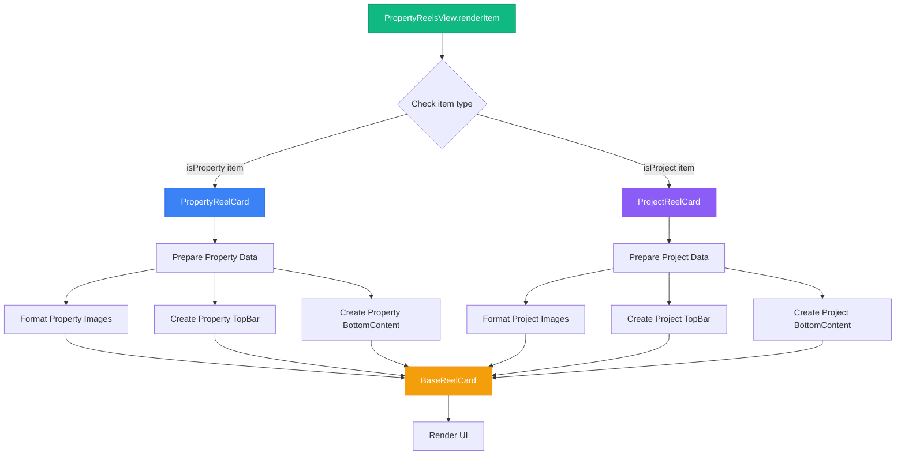

---

## 📦 Props Breakdown

### PropertyReelsView → PropertyReelCard/ProjectReelCard

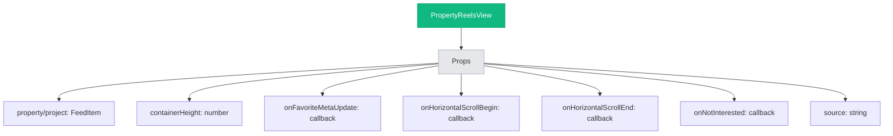

### PropertyReelCard/ProjectReelCard → BaseReelCard

```mermaid
graph TB
    A[Card Component] --> B[Props to BaseReelCard]
    B --> C[images: string[]]
    B --> D[topBarContent: ReactNode]
    B --> E[bottomContent: ReactNode]
    B --> F[onFavorite: function]
    B --> G[onChat: function]
    B --> H[onShare: function]
    B --> I[onAgentPress: function]
    B --> J[onView: function]
    B --> K[isLiked: boolean]
    B --> L[favoriteCount: number]
    B --> M[isChatLoading: boolean]
    B --> N[onImageChange: function]
    B --> O[containerHeight: number]
    B --> P[onHorizontalScrollBegin: function]
    B --> Q[onHorizontalScrollEnd: function]
    
    style A fill:#3b82f6,stroke:#2563eb,color:#fff
    style B fill:#e5e7eb,stroke:#9ca3af
```

---

## 🎨 UI Layout Structure

```mermaid
graph TD
    A[BaseReelCard Container] --> B[ScrollView Horizontal]
    B --> C[Image 1]
    B --> D[Image 2]
    B --> E[Image N...]
    
    A --> F[LinearGradient Bottom]
    A --> G[Top Bar Content]
    A --> H[Side Actions Column]
    A --> I[Bottom Content]
    
    G --> G1[Tag Line]
    G --> G2[Photo Counter]
    
    H --> H1[Heart Icon]
    H --> H2[Favorite Count]
    H --> H3[Chat Icon]
    H --> H4[Share Icon]
    H --> H5[Agent Icon]
    H --> H6[View Button]
    
    I --> I1[Agent Name]
    I --> I2[Title]
    I --> I3[Price]
    I --> I4[Location]
    I --> I5[Stats Pills]
    
    style A fill:#000,stroke:#10b981,color:#fff
    style B fill:#1f2937,stroke:#374151
    style H fill:#f59e0b,stroke:#d97706,color:#fff
    style I fill:#3b82f6,stroke:#2563eb,color:#fff
```

---

## 🔄 State Management Flow

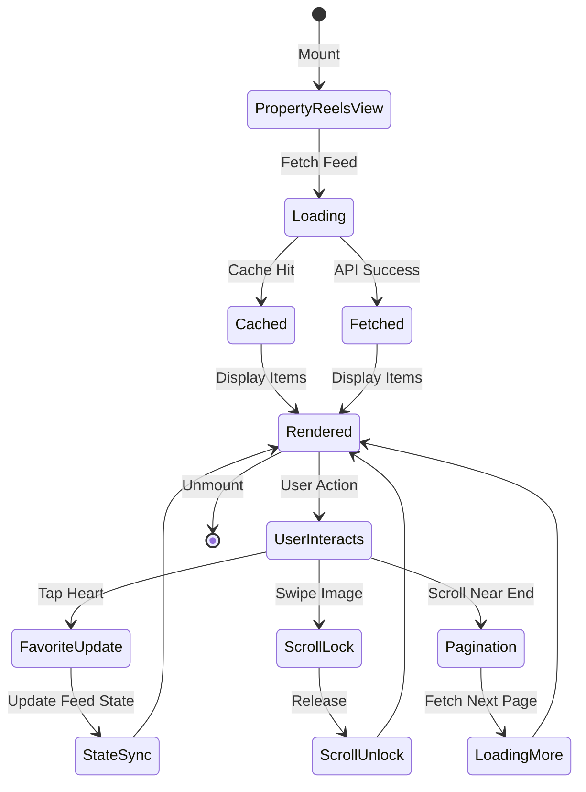

---

## 🎯 Callback Chain Visualization

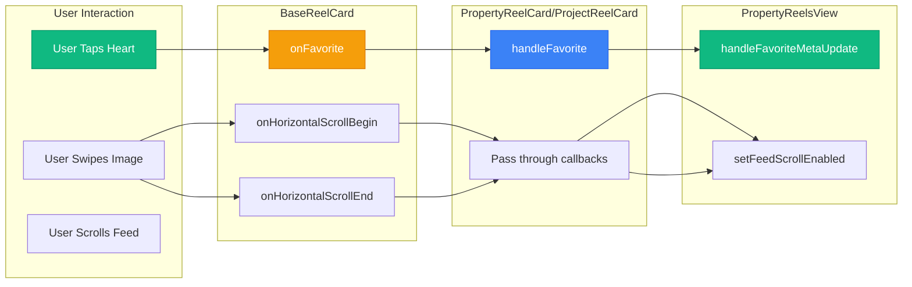

---

## 📊 Component Comparison

```mermaid
graph TB
    subgraph "PropertyReelCard"
        A1[Single Price]
        A2[Single Stats]
        A3[api.properties]
        A4[/property/id]
    end
    
    subgraph "ProjectReelCard"
        B1[Price Range]
        B2[Stat Ranges]
        B3[Units Available]
        B4[api.listings]
        B5[/project/id]
    end
    
    subgraph "Shared BaseReelCard"
        C1[Image Carousel]
        C2[Side Actions]
        C3[Double-Tap]
        C4[Heart Animation]
        C5[Scroll Lock]
    end
    
    A1 --> C1
    A2 --> C2
    A3 --> C3
    A4 --> C4
    
    B1 --> C1
    B2 --> C2
    B3 --> C3
    B4 --> C4
    B5 --> C5
    
    style A1 fill:#3b82f6,stroke:#2563eb,color:#fff
    style B1 fill:#8b5cf6,stroke:#7c3aed,color:#fff
    style C1 fill:#f59e0b,stroke:#d97706,color:#fff
```

---

## 🚀 Lifecycle Flow

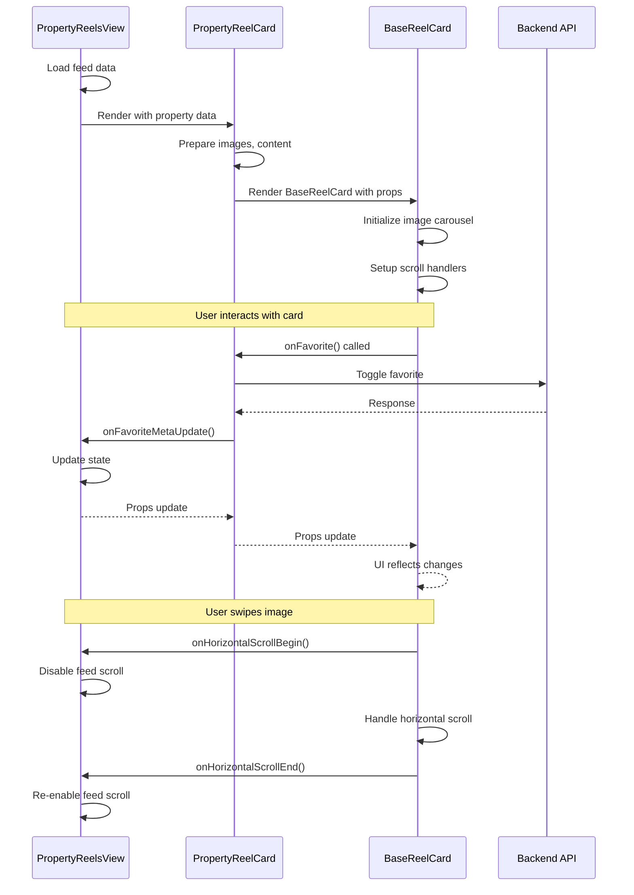

---

These diagrams show how the components interact, how data flows between them, and how user interactions are handled throughout the system.
